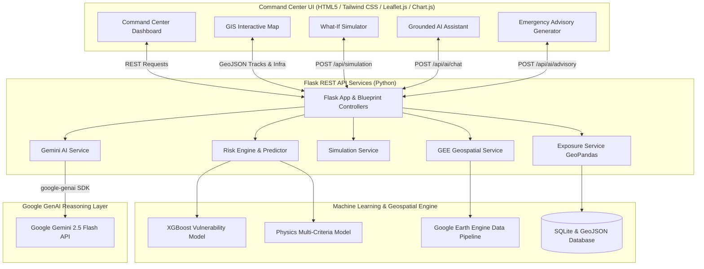

# CycloneShield AI — Infrastructure Vulnerability & Decision Support Platform

> **AI-Powered Cyclone Impact, Geospatial Vulnerability Estimation & Pre-Landfall Emergency Decision Support for Coastal India.**

---

## 📌 Problem

Coastal states across India (West Bengal, Odisha, Andhra Pradesh, Tamil Nadu) face recurring severe cyclonic storms in the Bay of Bengal and Arabian Sea. While meteorological agencies (such as IMD) provide track and wind velocity forecasts, disaster managers face critical gaps prior to landfall:
1. **Lack of Infrastructure Exposure Granularity**: Knowing peak wind speed (e.g. 115 knots) does not immediately answer how many hospitals, power substations, cyclone shelters, and transport corridors will experience structural stress.
2. **Abstract Numerical Risk**: Numerical weather prediction models output meteorological figures rather than an actionable **Infrastructure Vulnerability Risk Score (0–100)**.
3. **Communication Bottlenecks**: Disaster management authorities need rapid, grounded, non-fabricated pre-landfall operational advisories to stage resources, order mandatory evacuations, and de-energize vulnerable power grids.

---

## 💡 Solution

**CycloneShield AI** bridges meteorological science, geospatial analysis, machine learning, and generative AI reasoning into a single disaster-response Command Center:

- **Interactive Geospatial Command Center**: Leaflet GIS visualization displaying storm tracks, historical telemetry nodes, landfall points, and multi-tier hazard buffers (25km Eye Core, 50km Gale Radius, 100km Outer Band).
- **ML Infrastructure Vulnerability Engine**: An XGBoost Regressor ($R^2 = 0.9737$) combined with a Multi-Criteria Physics baseline model calculating an **Infrastructure Vulnerability Risk Score (0–100)** and categorizing threat levels (`LOW`, `MODERATE`, `HIGH`, `EXTREME`).
- **Spatial Infrastructure Exposure Analysis**: GeoPandas & Shapely buffer intersections identifying specific hospitals, cyclone shelters (with capacity counts), power substations, and transport corridors inside storm buffers.
- **Grounded Google Gemini AI Reasoning**: Reasoning layer using Google's official `google-genai` SDK (`gemini-2.5-flash`) providing grounded narrative explanations, Q&A chat, what-if analysis, and pre-landfall emergency advisories with strict non-fabrication rules.
- **What-If Scenario Stress Testing**: Interactive simulator allowing disaster managers to adjust wind speed, rainfall intensity, and lateral track offset to evaluate stress tests on coastal infrastructure.
- **Pre-Landfall Emergency Advisories**: Auto-generated structured operational directives with markdown export and PDF printing, carrying explicit decision-support disclaimers.

---

## 🏗️ Architecture



---

## 🛠️ Technology Stack

- **Backend**: Python 3.14+, Flask, Flask-CORS, Gunicorn
- **Machine Learning**: XGBoost, Scikit-Learn, Joblib, NumPy, Pandas
- **Geospatial & GIS**: GeoPandas, Shapely, PyPROJ, Google Earth Engine Python API (`ee`)
- **Generative AI**: Official Google GenAI SDK (`google-genai` v2.25.0)
- **Database**: SQLite & GeoJSON
- **Frontend**: HTML5, Vanilla JavaScript (ES6+), Tailwind CSS (CDN), Leaflet.js (v1.9.4), Chart.js

---

## 📊 Data Sources

1. **Cyclone Track Telemetry**: NOAA International Best Track Archive for Climate Stewardship (**IBTrACS**) historical & real-time track telemetry.
2. **Infrastructure Data**: OpenStreetMap (**Overpass API**) spatial datasets for hospitals, emergency shelters, power substations, highways, and railway corridors in coastal India.
3. **Topography & Elevation**: Digital Elevation Model (**DEM**) data via Shuttle Radar Topography Mission (**SRTM** / Google Earth Engine).
4. **Satellite Imagery**: Sentinel-1 Synthetic Aperture Radar (**SAR**) & Sentinel-2 Optical earth observation data via Google Earth Engine.

---

## 🤖 AI & LLM Usage

Google Gemini AI serves as the **reasoning and communication layer**.
- **Model**: `gemini-2.5-flash` via official `from google import genai` SDK (`genai.Client(api_key=...)`).
- **Grounded Non-Fabrication Rule**: Gemini is strictly constrained by system instructions to explain risks using figures provided in the numerical payload. Gemini does NOT invent numerical scores, wind speeds, rainfall values, or hospital counts.
- **Key Services**:
  - **Risk Explanation**: `POST /api/ai/explain`
  - **Grounded Assistant Chat**: `POST /api/ai/chat`
  - **What-If Scenario Analysis**: `POST /api/ai/scenario-analysis`
  - **Emergency Advisory Generation**: `POST /api/ai/advisory`

---

## 🧠 Machine Learning Approach

The **Infrastructure Vulnerability Risk Engine** computes a 0–100 score:
- **Baseline Model**: Physics-based multi-criteria index weighting 5 core hazard axes:
  $$\text{Score} = 0.35 \cdot \text{Wind} + 0.25 \cdot \text{Rain} + 0.20 \cdot \text{Surge} + 0.20 \cdot \text{Exposure} - \text{Mitigation}$$
- **XGBoost Regressor**: Trained on normalized physical hazard parameters and spatial exposure density ($R^2 = 0.9737$, $\text{RMSE} = 2.1762$).
- **Risk Tiers**:
  - `LOW` ($0 - 25$)
  - `MODERATE` ($26 - 50$)
  - `HIGH` ($51 - 75$)
  - `EXTREME` ($76 - 100$)

---

## 🌍 Google Earth Engine (GEE) Usage

GEE provides real-time satellite earth observation data for coastal regions:
- **Elevation Extractor**: `gee/scripts/get_elevation.py` extracts mean regional elevation ($\text{meters}$).
- **SAR Flood Inundation Detector**: `gee/scripts/get_satellite_imagery.py` processes Sentinel-1 SAR imagery to detect surface water backwater flooding ($\text{sq km}$).
- **GEE API Endpoints**:
  - `GET /api/gee/layers`
  - `GET /api/gee/elevation`
  - `GET /api/gee/satellite`

---

## 🚀 Setup & Installation Instructions

### Prerequisites
- Python 3.10+ installed
- Node.js / npm (optional, for local static serving if desired)
- Google Gemini API Key (optional for live AI calls; grounded fallback engine available offline)

### Step 1: Clone & Navigate
```bash
git clone https://github.com/your-username/CycloneShield-AI.git
cd CycloneShield-AI
```

### Step 2: Virtual Environment Setup
```bash
python -m venv venv
# On Windows PowerShell:
.\venv\Scripts\Activate.ps1
# On Linux/macOS:
source venv/bin/activate
```

### Step 3: Install Dependencies
```bash
pip install -r backend/requirements.txt
```

### Step 4: Environment Variables Setup
Create a `.env` file in the root directory:
```env
FLASK_ENV=development
PORT=5000
GEMINI_API_KEY=your_google_gemini_api_key_here
GEMINI_MODEL=gemini-2.5-flash
```

### Step 5: Run Automated Unit Test Suite
```bash
python -m pytest tests/ -v
```
*(All 30 unit tests should pass cleanly).*

### Step 6: Start Backend Server
```bash
python backend/app.py
```
*(The Flask backend will launch at `http://localhost:5000`).*

### Step 7: Open Command Center UI
Open your browser and navigate to:
```text
http://localhost:5000
```

---

## ⚠️ Limitations & Disclaimers

1. **Decision Support Only**: CycloneShield AI outputs an **Infrastructure Vulnerability Risk Score** for civil defense stress testing and decision support. It is **NOT** an official weather forecast or official government evacuation order.
2. **Demo Scenario Data**: Historical cyclone track data (e.g. Cyclone Amphan, Cyclone Fani) and public OpenStreetMap datasets are used for demonstration.
3. **No Exact Physical Damage Prediction**: The system estimates vulnerability indices (0–100) and spatial asset exposure, not exact financial or physical structural destruction.

---

## 🎯 Demo Instructions for Hackathon Judges

Follow this step-by-step walkthrough to experience the full platform:

1. **Step 1: Open Command Center** (`http://localhost:5000`)
   - Notice the top navigation bar showing **TELEMETRY ACTIVE** and **DEMO SCENARIO MODE**.
   - Review the **5-Step Decision Flow Banner** (`CYCLONE TELEMETRY ➔ VULNERABILITY RISK ➔ INFRASTRUCTURE EXPOSURE ➔ AI REASONING ➔ ACTION DIRECTIVES`).

2. **Step 2: Select Storm & View GIS Map**
   - Use the **Active Storm** selector dropdown to toggle between **Cyclone Amphan (2020)** and **Cyclone Fani (2019)**.
   - Inspect the Leaflet map showing the track polyline, landfall marker, and multi-tier hazard buffers (25km Eye Core, 50km Gale Buffer, 100km Outer Band).

3. **Step 3: Review Infrastructure Exposure & Risk Metrics**
   - Observe the top metric cards showing **Infrastructure Vulnerability Risk Score** (`84.5 EXTREME`), Peak Wind (`115 kts`), 24h Rain (`280 mm`), and Exposed Assets (`87`).
   - Toggle map layer checkboxes (`Hospitals`, `Shelters`, `Power`, `Roads`).

4. **Step 4: Explore Infrastructure Inventory Tab**
   - Click the **Infrastructure Exposure** tab in the navigation bar.
   - Review the detailed asset table listing exposed facilities, threat levels, and spatial exposure rationales.

5. **Step 5: Inspect Risk Analysis Radar Chart**
   - Click the **Risk Analysis** tab.
   - View the 5-axis Chart.js radar chart showing wind load, rainfall, surge, infrastructure exposure, and topography.

6. **Step 6: Run What-If Scenario Simulation**
   - Click the **What-If Simulation** tab.
   - Adjust the **Wind Speed Slider** ($+20\text{ kts}$), **Rainfall Slider** ($+30\%$), and **Lateral Shift Slider** ($15\text{ km WEST}$).
   - Click **⚡ RUN WHAT-IF SIMULATION**.
   - Compare the side-by-side **BASELINE CARD** vs **SIMULATED SCENARIO CARD**, review the threat delta ($\Delta: +7.6$), and read the Gemini AI scenario reasoning.

7. **Step 7: Interact with Grounded AI Assistant**
   - Click the **AI Assistant** tab.
   - Click one of the preset chips (e.g. `🏥 High-Risk Hospitals`) or type a custom question.
   - Observe the grounded, non-fabricated response referencing the current storm context.

8. **Step 8: Generate & Download Pre-Landfall Emergency Advisory**
   - Click the **Emergency Advisory** tab.
   - Review the AI-generated operational directives and mandatory disclaimers.
   - Click **📥 DOWNLOAD ADVISORY (.MD)** to export the Markdown advisory file or **🖨️ PRINT / SAVE PDF** for printable report formatting.
